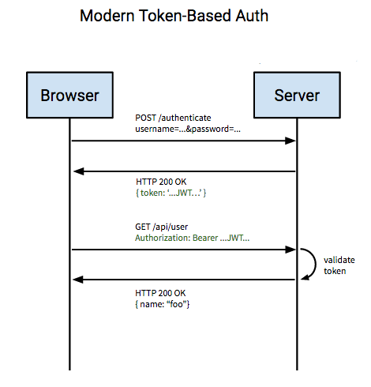

## JWT : JSON Web Token

* [RFC 7519](https://datatracker.ietf.org/doc/html/rfc7519)
* Specialized website about JWT with tools and documentation : [JWT Web Decoder](https://jwt.io/)

JWT는 JSON 객체를 통해 안전하게 정보를 전송할 수 있는 웹 표준 RFC7519 이다.  
간단하게 말해 JSON을 사용한 TOKEN 인증 방식을 말한다.


##xxxx.yyyy.zzzz  
구조는 위와 같으며 '.' 으로 각각 구분된 문자열로 이루어져 있다.


각각의 파트는 
- Header
- Payload
- Signature 

세 부분으로 이루어져있다.  
헤더는 토큰 타입과 해싱 알고리즘을 저장하고, 페이로드는 실제 전달할 정보를, 서명에는 위변조 방지를 위한 값이 들어간다. 

1. Header  
   헤더는 typ와 alg 두가지 정보로 구성된다.
   typ는 토큰의 타입을 지정한다.  
   alg는 Signature를 해싱하기위한 알고리즘을 지정한다. 
   

2. Payload  
토큰에서 사용할 정보들의 조각인 Claim이 담겨있다.
   클레임은 Registered Claim, Public Claim, Private Claim 세가지로 나누어진다.
   JSON 형태로 정보들을 담는다.
   - 등록된 클레임  
    이미 정해진 종류의 데이터들로 선택적 작성이 가능하나 사용이 권장된다.  
     간결성을 위해 key의 길이는 모두 3이다. 
     - iss : 토큰 발급자 issuer
     - sub : 토큰 제목 subject
     - aud : 토큰 대상자 audience
     - exp : 토큰 만료 시간 expiration (ex 1123451351351)
     - nbf : 토큰 활성 날짜 not before (활성날짜 이후부터 활성화됨)
     - iat : 토큰 발급 시간 issued at (토큰발급 이후의 경과시간) 
     - jti : JWT 토큰 식별자
    - 공개 클레임
        - 사용자 정의 클레임으로 공개용 정보를 위해 사용되고 uri 포맷을 사용해 충돌을 방지한다 
        ```
      { 
      "https://chunnycode.github.io" : true
        }
      ```
    - 비공개 클레임
        - 사용자 정의 클레임으로 서버와 클라이언트 사이에 임의의 정보를 저장한다.
        ```
       { 
          "userId" : user1
          "userName" : chunnycode
       }
      ```
3. Signature  
   고유의 암호화 코드로 토큰을 인코딩하거나 유효성 검증을 할 때 사용한다.  
   헤더와 페이로드의 값을 각각 base64url로 인코딩후, 그 값을 비밀 키를 이용해 헤더에서 정의한 알고리즘으로 해싱하고  
   이 값을 다시 base64url로 인코딩하여 생성한다. 

## JWT 로그인 vs 세션 로그인 

보통 로그인을 구현할 때 세션을 사용한다.  
클라이언트에서 서버로 로그인을 요청하면 서버는 정보를 확인후 세션 아이디를 서버에 저장하고 클라이언트에게도 보낸다.  
이후 클라이언트는 요청시 세션아이디를 쿠키에 담아서 요청한다.   
서버는 쿠키 속 세션아이디를 확인해 로그인된 사용자인지 확인하는 방식이다. 


JWT 방식은 클라이언트가 서버에 로그인 요청을 보내면 정보를 확인 후 토큰으로 응답한다.
이 때 토큰에는 사용자에 대한 정보가 일부 담겨있다. 
토큰은 서버에 저장하지 않는다.  
이후 클라이언트는 요청시 헤더에 토큰을 함께 보낸다.
비대칭키 암호화 방식을 사용하기 때문에 서버측에서는 이 토큰을 받아 시그니처를 복호화하여 디코딩하는 방식으로 토큰의 유효성을 검증한다.
인증이 필요한 리소스에 접근할 시 복잡한 인증 과정 없이 토큰만으로 인증 및 인가를 한다.



### 특징 

- 최근 범용적으로 사용되고있고 웹, 모바일 호환성이 좋다.
- Payload가 많아져 토큰이 커지면 서버에 부담이 될수도 있다. 
- 토큰 재발급 전에 사용자 정보가 갱신되면 갱신된 정보가 적용되지 않는다.
- Stateless 환경에서 용이하다. 
- 만료시간전까지는 강제로 만료시킬 수 없어 노출되지 않도록 관리하는것이 중요하다.

### 탈취자에게도 허용한다. 

JWT는 Stateless한 방식이다. 따라서 서버측에서는 토큰을 가진 사람이 정말 권한이 있는 당사자인지 확인할 수 없다는 특징이 있다. 
토큰 만으로 인증과 인가를 하기 때문에 액세스 토큰을 탈취하여 사용해도 그것을 구분할 수 없다는 의미이다. 

### Refresh Token의 사용 

그래서 여러가지 보완을 하는 장치들이 생겨났다. 
RFC7519 에도 나와있지 않고 혹자는 권장사항이 아니라고도 하는 것을 읽었으나
대표적으로 사용되는 방법으로는 Refresh Token 이 있다.  

방법은 이러하다.
리프레시 토큰은 사용자를 인증하는 것이 아니라 Access Token을 생성하는 용도로 쓰인다.
Access Token을 탈취당했더라도 유효기간을 짧게 설정하여 피해가 최소화 되도록 하기 위해 Access Token의 만료 시간을 짧게 설정한다.    
Refresh Token의 유효기간은 길게 설정한다. 
사용자는 두 토큰을 서버에 전송해 인증하고, 만료시에는 Refresh Token으로 새로운 Access Token을 받아 저장한다. 
Access Token이 탈취되어도 유효기간이 짧아 쓸 수 없도록 한 것이다. 
정상적인 사용자는 Refresh Token을 사용하여 새로운 Access Token을 생성하고 사용할 수 있다. 

### Refresh Token이 탈취당하면 

이또한 구분할 수 없다. 
이를 보완하기 위해서는 서버에 저장공간을 사용하게 된다.
이 부분에서는 여러가지 방법이 존재하는듯 하다.  

Access Token과 Refresh Token 쌍을 저장하고 둘 다 확인하여 누군가가 쌍이 다른 Token을 보내오면 모든 토큰을 만료시키는 방법이다. 
토큰 위조를 어느정도 변별하고, 변조가 감지되었을 때 모두 만료시켜 새로운 로그인이 필요하도록 만드는 것이다.
혹자는 Refresh Token을 일회성으로 만드는 방법도 고려한다고 하였다. 

### 로그아웃 

클라이언트에서 저장된 토큰을 삭제하면 된다.
혹시라도 로그아웃한 당시의 액세스토큰으로 접근했을 때 로그아웃 처리가 되도록 만료시키는 효과를 주고 싶다면  
어떤식으로든 서버측의 저장소를 사용할 수 밖에 없다. 
서버측에 Access Token을 블랙리스트처럼 만료로 저장해두고 관리하던가, 
혹자는 로그아웃 토큰을 구현하기도 하는것 같다. 

그런데 서버의 저장소를 많이 사용한다면 토큰을 사용하는 의미가 퇴색되는것은 아닌가 하는 의문이 들기도 한다.

### 구현 

스프링을 비롯한 각종 프레임워크에서 이미 JWT에 관한 구현체가 준비되어있기 때문에 가져다 쓰면 된다. 
Spring의 경우 Jwts, Claim이 지원된다. 
구현한 일부 코드는 이러하다. 


```

@Slf4j
@RequiredArgsConstructor
@Component
public class TokenProvider {

    @Value("${secret.access}")
    private String secretKey;
    @Value("${secret.refresh}")
    private String refreshKey;

    private final long accessTokenValidTime = 60 * 1000L; // 1 hour
    private final long refreshTokenValidTime =  7 * 24 * 60 * 60 * 1000L;   // 1 week

    @PostConstruct
    protected void init() {
        secretKey = Base64.getEncoder().encodeToString(secretKey.getBytes());
        refreshKey = Base64.getEncoder().encodeToString(refreshKey.getBytes());
    }

    public String createAccessToken(String memberId){

        Claims claims = Jwts.claims();  // JWT payload 에 저장되는 정보단위
        claims.put("memberId", memberId);
        Date now = new Date();

        return Jwts.builder()
                .setClaims(claims) 
                .setIssuedAt(now) 
                .setExpiration(new Date(now.getTime() + accessTokenValidTime)) 
                .signWith(SignatureAlgorithm.HS256, secretKey)
                .compact();
    }

    public String createRefreshToken(String memberId){
        Claims claims = Jwts.claims();
        claims.put("memberId", memberId);
        Date now = new Date();

        return Jwts.builder()
                .setClaims(claims)
                .setIssuedAt(now)
                .setExpiration(new Date(now.getTime() + refreshTokenValidTime))
                .signWith(SignatureAlgorithm.HS256, refreshKey)
                .compact();
    }

    public String resolveAccessToken(HttpServletRequest request) {
        log.info("AccessToken is " + request.getHeader("accessToken"));
        return request.getHeader("accessToken");
    }

    public String resolveRefreshToken(HttpServletRequest request) {
        log.info("RefreshToken is " + request.getHeader("refreshToken"));
        return request.getHeader("refreshToken");
    }

    public Claims getClaimsAccessToken(String token) {
        return Jwts.parserBuilder()
                .setSigningKey(DatatypeConverter.parseBase64Binary(secretKey))
                .build()
                .parseClaimsJws(token)
                .getBody();
    }

    public Claims getClaimsRefreshToken(String token) {
        return Jwts.parserBuilder()
                .setSigningKey(DatatypeConverter.parseBase64Binary(refreshKey))
                .build()
                .parseClaimsJws(token)
                .getBody();
    }
    
    ...... 

```


### 이해한 것 

간단한 구현과 함께 공부를 하고나서 JWT에 대해 내가 이해한 핵심 내용은  
JWT 토큰이 가지는 인증, 인가, 유효성 등을 적절하게 사용하는 것에 있다고 생각하였고
JWT 토큰 사용시 발생하는 단점들에 대한 보완정책들
Token 발급 시 DB를 조회하도록 할 것인가에 대한 부분이라던가, 여러가지 동시 로그인, 로그아웃에 대한 제어 등에 관한 문제는  
서비스를 개발하는 사람이 선택하여 작성할 문제라고 파악하였다.

+추가  
JWT를 사용하는 것은 저장하지 않기 위함보다는, 세션 공유를 위해 클러스터링을 사용하는 등의 작업을 하지 않고서도 
스케일 업다운을 편리하게 할 수 있는 이점이 있는 부분이 크다고 한다.  
실무에서는 꼭 로그인이 아니더라도 권한관리에도 사용한다고 하며, 
발급내역들은 저장해 유효성 검증을 보강하는 방향으로 활용한다고 한다. 

위와 같은 점을 반영해 프로젝트를 디벨롭해보기로 한다. 


